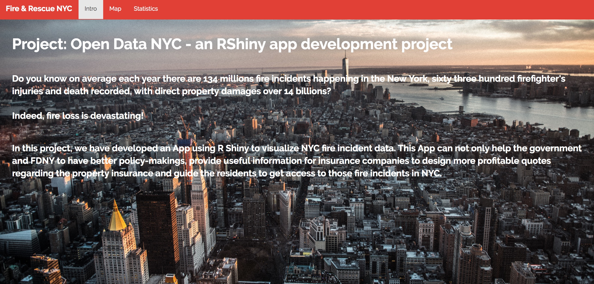
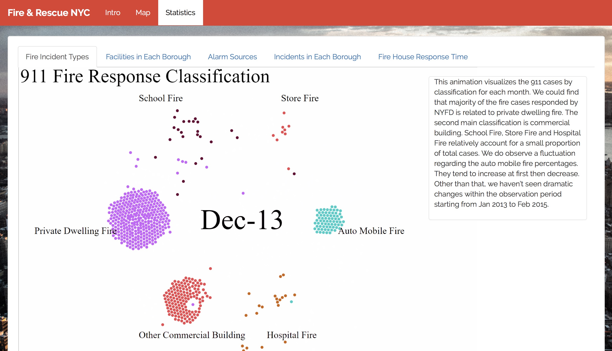
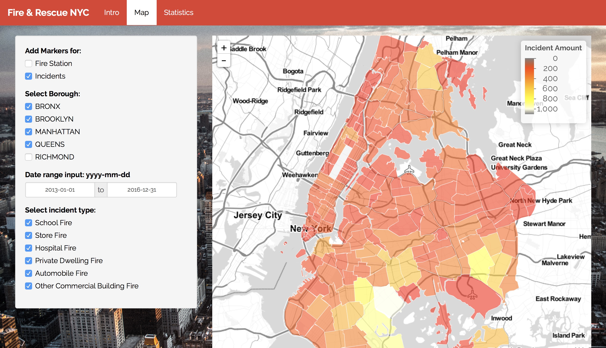

# Project 2: Open Data App - an RShiny app development project

### [Fire & Rescue NYC](https://guanzy.shinyapps.io/trafficcare2/)



In this second project of GR5243 Applied Data Science, we develop an *Exploratory Data Analysis and Visualization* shiny app on a topic of NYC Fire and Rescue. 

The **learning goals** for this project is:

- business intelligence for data science
- data cleaning
- data visualization
- systems development/design life cycle
- shiny app/shiny server


## Fire New York
Term: Spring 2018

+ Team #1
+ **Fire and Rescue**: 
	+ Jia, Zheng
	+ Yang Fan
	+ Qianhui, Wan
	+ Shiyu Liu
	+ Wenyi Tao

+ **Project summary**: 
	
	Do you know on average each year there are 134 millions fire incidents happening in the New York, sixty three hundred firefighter's injuries and death recorded, with direct property damages over 14 billions? 
	
	Indeed, fire loss is devastating!
		
	In this project, we have developed an App using R Shiny to visualize NYC fire incident data. This App can not only help the government and FDNY to have better policy-makings, provide useful information for insurance companies to design more profitable quotes regarding the property insurance and guide the residents to get access to those fire incidents in NYC. 

	In the map, users can easily find out the distribution and detailed locations of firehouses in all five boroughs of New York City. They can also search a certain fire incident happened in New York City through the date-time filter on map. In addition, they can interactively compare the amount of fire incidents between different boroughs during a specific period. Residents could use this map to find out the incidents around them, and the nearest fire stations in the area. Insurance companies could search for patterns and raise the relevant fire insurance quotes in the areas where fire incidents were more likely to occur. 

	In the second part of the Shiny App, we applied various data visualization tools (animated bar plot, interactive circle packing, JavaScript library) to analyze the fire incident data as it relates to the assignment of resources and the Fire Department's responses to the emergency. For example, we observed six types of fire incidents including the school fire, auto mobile fire, private dwelling fire and found out private dwelling fire took place more frequently. Also, Queens has the most number of fire incidents but without enough number of fire facilities relatively. As for the assignment of resources, engine unit was most popular fire companies assigned, followed by ladder companies. As a result, FDNY should allocate more engine units in the facilities of high-risk areas, like Queens. 
	




+ **Contribution statement**: 
	
	All team members are actively involved in all stages of this project and help design the app. All team members approve our work presented in this GitHub repository including this contributions statement. 

	Zheng, Jia: Mainly responsible to create the structure of shiny app, design and built the framework of the shiny app and integrate all parts into a complete product. 
	
	Yang, Fan: Mainly responsible to create map for firehouse and fire incidents and add informative and interesting filters to complete the shiny structure, provide suggestions on app's structure. 

	Wan, Qianhui: Clean the large dataset for analysis. Mainly responsible on the statistical analysis for alarm source animated bar plot and fire incident dispatch time changes. Contribute the introduction and all text parts
	
	Liu, Shiyu: created, designed and processed the data for the Statistics page. Finished statistical analysis for animated bar plot and interactive circle packing. Provide suggestions on app's structure.

	Tao, Wenyi: (Outstanding Contributor) Using JavaScript library to analyze the Fire incident classifications, and assignment of resources during incidents. provide suggestions on app's structure.


Following [suggestions](http://nicercode.github.io/blog/2013-04-05-projects/) by [RICH FITZJOHN](http://nicercode.github.io/about/#Team) (@richfitz). This folder is orgarnized as follows.

```
proj/
├── app/
├── lib/
├── data/
├── doc/
└── output/
```

Please see each subfolder for a README file.

